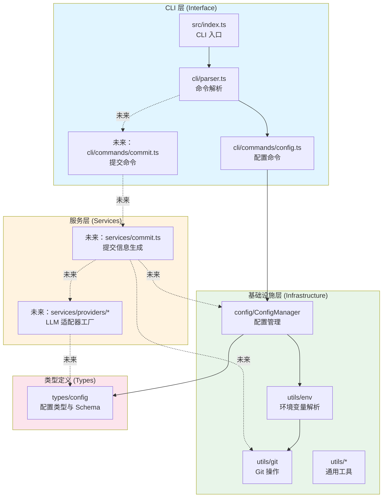

# 功能架构设计总览

本设计文档基于当前 `ai-commit-cli` 代码库，对现有能力与未来扩展方向进行结构化梳理，便于新成员快速理解整体架构并在此基础上演进 AI 辅助提交信息的完整体验。

## 设计目标

- **CLI 入口统一化**：为所有子命令提供一致的启动流程、日志体验与错误处理策略。
- **配置能力模块化**：将配置枚举、存储、校验与 CLI 交互拆分为独立层次，便于扩展新项或替换存储方案。
- **环境感知与优先级管理**：支持命令行环境变量、`.env` 与本地配置三层合并，确保不同部署环境下的行为可预期。
- **服务扩展预留**：在保持当前配置命令可用的前提下，为后续“AI 生成提交信息”功能预留服务抽象、Provider 插拔点与测试策略。
- **可维护性**：通过严格的类型约束、单元测试与文档化流程，降低长期维护成本。

## 系统分层



**说明**：

- **CLI 层**：负责用户交互，解析命令行参数，调用服务层
- **服务层**：封装业务逻辑（AI 提交生成），协调基础设施层
- **基础设施层**：提供技术能力（配置、Git、环境变量、工具函数）
- **类型定义层**：共享的 TypeScript 类型定义

虚线表示未来扩展，实线表示当前已实现。

## 核心模块职责

### 1. CLI 入口与命令解析

- `src/index.ts`：初始化 CLI 流程，负责展示欢迎语、捕获 `ExitPromptError` 并统一退出码。
- `src/cli/parser.ts`：基于 `mri` 解析命令行参数，路由至各子命令，同时提供 `help` 文案与友好的错误提示。
- `src/cli/commands/config.ts`：实现 `set`/`get`/`ls` 子命令，处理键值解析、类型转换、表格输出与错误提示。

### 2. 配置域

- `src/types/config.ts`：集中维护 11 个配置项、对应的 TypeScript 类型与 JSON Schema 属性，禁止使用 `enum`，便于 `as const` 推断与运行时校验。
- `src/config/ConfigManager.ts`：负责配置值的读取、写入、来源标记、类型校验与优先级合并，内部基于 `conf` 实现持久化。
- `docs/config-management-design.md`：对配置系统的工作流程、优先级策略与扩展指南做了进一步说明，可与本总览互相引用以获取细节。

### 3. 环境工具与通用工具

- `src/utils/env.ts`：提供环境变量名规范化、合法性校验、`.env` 查找与解析、环境映射合并等能力，是 ConfigManager 的输入来源之一。
- `src/utils.ts`：封装基础字符串与错误信息工具，供 CLI 输出与其他模块复用。
- `src/utils/checkIsLatestVersion.ts`：封装版本检测逻辑，未来可在 CLI 启动时启用提示用户更新。

### 4. 测试与质量保障

- `tests/config/ConfigManager.test.ts`：验证配置优先级、类型校验与来源标记等关键行为，并通过 mock `conf` 避免文件系统依赖。
- `tests/cli/commands/config.test.ts`：确保 CLI 命令层正确调用 ConfigManager、处理参数与错误情况。
- `tests/utils.test.ts`：覆盖基础工具函数的行为，保证公共函数稳定。
- `package.json` 中的脚本 `bun run lint|typecheck|test|ci` 形成提交前质量门禁，结合 Husky/Commitlint 保证规范提交（详见仓库根部协作指南）。

## 运行时流程

1. `node dist/index.cjs` / `bun run debug` → 入口脚本调用 `runCLI()` 并展示 intro/outro。
2. `runCLI` 使用 `mri` 解析参数，判断主命令：
   - `config` → 进入配置子命令处理。
   - 其他命令 → 提示未知命令（为未来主功能预留扩展点）。
3. 配置子命令中：
   - `ConfigManager` 接受 CLI 环境变量（由 `normalizeCliEnv` 过滤）与 `.env` 文件内容，并加载 `conf` 持久化层。
   - 读取/设置时遵循优先级：CLI env → `.env` → config store，返回值附带 `source`。
   - CLI 层负责输出格式化结果，并以统一颜色提示来源或错误。

## 扩展路线图（AI 提交生成功能）

为实现核心的 "AI 自动生成 Conventional Commit" 能力，建议按照下列步骤逐步实现：

### 1. 命令层扩展

- 新增 `src/cli/commands/commit.ts` 实现 `aigcm commit` 子命令
- 在 `parser.ts` 中注册新命令，默认命令也可指向 commit
- 命令流程：读取配置 → 收集 Git 变更 → 调用 LLM → 展示候选消息 → 用户确认 → 执行提交

### 2. 服务层实现

**核心服务**：`src/services/commit.ts`

```typescript
export async function generateCommitMessage(
  diff: string,
  config: ConfigSchema
): Promise<string[]> {
  // 1. 根据配置选择 Provider
  const provider = createProvider(config);
  // 2. 构建 Prompt
  const prompt = buildPrompt(diff, config);
  // 3. 调用 LLM 生成
  const result = await provider.generate(prompt);
  // 4. 解析并返回候选消息
  return parseCommitMessages(result);
}
```

**Provider 适配器**：`src/services/providers/`

- `base.ts`：定义 `LLMProvider` 接口
- `openai.ts`：OpenAI API 适配器
- `gemini.ts`：Google Gemini 适配器
- `dify.ts`：Dify 平台适配器
- `factory.ts`：根据 `AIGCM_LLM_PROVIDER` 创建对应实例

### 3. 基础设施增强

**Git 工具封装** ✅ 已实现：`src/utils/git.ts`

- `getRepoRoot()`：获取仓库根目录
- `isInsideRepo()`：检查是否在 Git 仓库中
- `getCurrentBranch()`：获取当前分支名
- `getStagedFiles()`：获取暂存区文件列表
- `getStatus()`：获取仓库状态
- `getStagedDiff()`：获取暂存区 diff
- `getStagedDiffStat()`：获取 diff 统计信息
- `commit(message: string)`：执行提交
- `add(paths?: string[])`：添加文件到暂存区

**配置增强**（如需要）：

- ConfigManager 已经支持所有必需配置项
- 可以在 commit 命令初始化时进行配置完整性验证

### 4. 用户交互

使用 `@clack/prompts` 实现交互流程：

1. **检查 Git 状态**：确认有暂存的变更
2. **生成候选消息**：调用 LLM 生成 2-3 条候选
3. **用户选择**：使用 `select` 组件让用户选择或编辑
4. **确认提交**：使用 `confirm` 组件二次确认
5. **执行提交**：调用 `git commit`
6. **错误处理**：LLM 失败时提供手动输入选项

### 5. 测试策略

- **单元测试**：

  - 各个 Provider 的 API 调用逻辑（使用 mock）
  - Prompt 构建逻辑
  - 提交消息解析逻辑

- **集成测试**：

  - Git 工具操作（使用临时仓库）
  - 完整的 commit 流程（mock LLM 响应）

- **E2E 测试**（可选）：
  - 使用真实 Git 仓库和 mock LLM 测试端到端流程

### 实施顺序

```text
Phase 1: 基础设施准备 ✅ 已完成
  1.1 封装 Git 工具类（utils/git.ts） ✅ 已完成
  1.2 实现配置验证器 ✅ 已完成
  1.3 定义错误类型 ✅ 已完成

Phase 2: Provider 层 ✅ 已完成
  2.1 定义 LLMProvider 接口 ✅ 已完成
  2.2 实现 OpenAI Provider ✅ 已完成
  2.3 实现 Provider 工厂 ✅ 已完成
  2.4 实现其他 Provider（Gemini、Dify） ✅ 已完成

Phase 3: 服务层与 CLI
  3.1 实现 Prompt 构建逻辑
  3.2 实现 generateCommitMessage 服务
  3.3 实现 commit 命令
  3.4 集成用户交互流程

Phase 4: 测试与完善
  4.1 编写单元测试
  4.2 编写集成测试
  4.3 优化错误处理与重试逻辑
  4.4 完善文档与使用示例
```

## 维护建议

- **文档联动**：当新增配置项或 Provider 时，更新本文件与 `docs/config-management-design.md`，保持文档与实现同步。
- **类型优先**：所有对外导出的 API 保持显式返回类型，若新增公共工具请集中在 `src/utils/` 并在 `src/index.ts` 中统一导出。
- **命令解耦**：新增 CLI 子命令时，将复杂逻辑拆分至 `services` 或 `utils` 层，避免命令文件过重。
- **错误策略**：优先使用 `ConfigManager` 的校验能力与 CLI 层彩色输出，确保用户能快速定位问题。
- **CI 流程**：保持 `bun run ci` 通过后再提交；若修改依赖或打包配置，请同步更新 `README` 对应章节。

## 关联文档

- [技术设计问题清单](./technical-issues.md)：记录代码审查中发现的设计问题与改进建议（按优先级分类）
- [配置管理系统设计](./config-management-design.md)：聚焦配置项与优先级的详细说明
- [仓库协作指南](../AGENTS.md)：约束代码风格、提交规范与提交流程，贡献者需首先阅读

通过以上架构说明，维护者可以快速定位现有代码职责，并按阶段构建 AI 提交生成功能所需的服务与命令模块，确保后续演进具备清晰路线与足够的扩展点。
